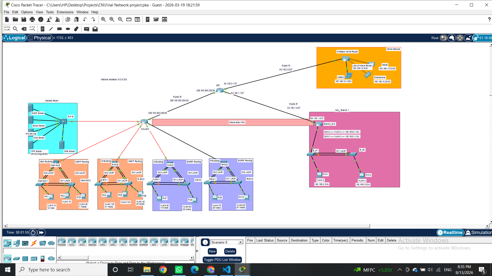

# Enterprise Campus Network Design & Implementation

> Cisco Packet Tracer | Enterprise Networking | Routing & Switching | Network Services | Network Security

## 📌 Overview

This project presents the design and implementation of a multi-building enterprise campus network using Cisco Packet Tracer.

The network includes a central campus, multiple buildings, a branch office, an ISP connection, servers, and a wireless network.

The project demonstrates the practical implementation of enterprise networking technologies including VLANs, inter-VLAN routing, dynamic routing, network services, NAT/PAT, and site-to-site IPsec VPN.
## 📸 Network Topology


## 🏗️ Network Architecture

The network consists of:

- Main Building
- S Building
- N Building
- R Building
- Central Campus Gateway
- Server Network
- Branch Office
- ISP Network
- Wireless Network

The network uses multilayer switches to provide Layer 3 routing and inter-VLAN communication.

## 🌐 IP Addressing & VLSM

The campus network uses the private `10.0.0.0/8` address space.

VLSM was implemented to allocate IP addresses efficiently according to the requirements of each network segment.

Major VLANs include:

| Building | VLANs |
|---|---|
| Main Building | VLAN 10, VLAN 20 |
| S Building | VLAN 40, VLAN 130 |
| N Building | VLAN 50, VLAN 60 |
| R Building | VLAN 70, VLAN 80 |

Point-to-point routed links use `/30` networks.

## 🔀 VLANs & Inter-VLAN Routing

VLANs were implemented to logically segment the enterprise network.

Inter-VLAN routing is provided by multilayer switches using Switch Virtual Interfaces (SVIs).

The implementation includes:

- VLAN segmentation
- Access ports
- Trunk links
- Switch Virtual Interfaces
- Inter-VLAN routing

## 🔗 EtherChannel

EtherChannel was implemented using **LACP** to provide link aggregation and redundancy between network devices.

Configuration and verification included:

```text
show etherchannel summary
show interfaces trunk
